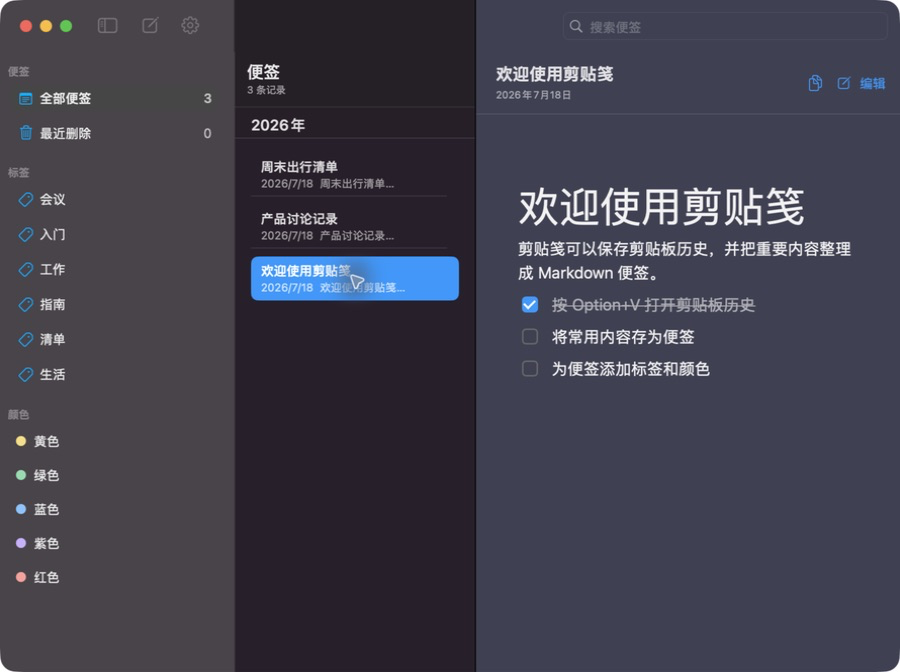
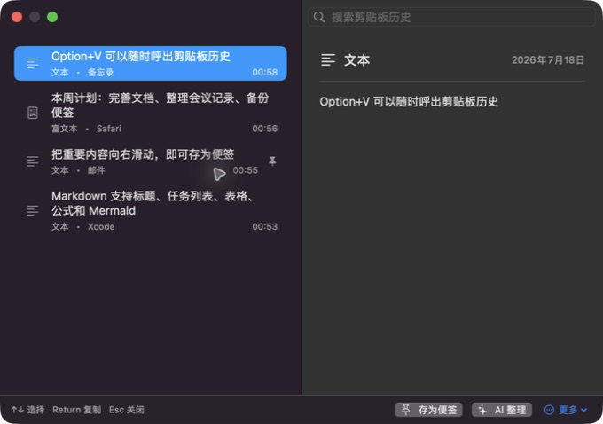
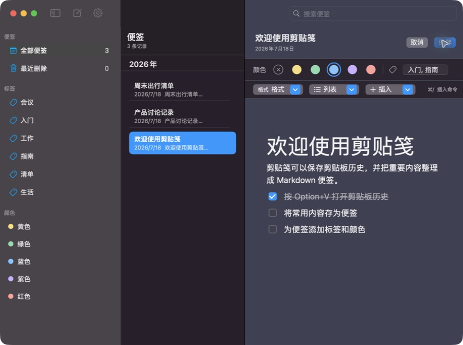

# 剪贴笺帮助手册

在剪贴笺运行时，可通过以下任一方式打开应用内帮助手册：

- 按 `Command+?`。
- 从菜单栏选择 `帮助 → 剪贴笺帮助`。

## 快速开始

1. 正常复制文本、富文本、图片或文件。
2. 按 `Option+V` 呼出剪贴板历史。
3. 选择记录后复制、存为便签，或使用 AI 整理。
4. 在主窗口中通过标签、颜色和搜索继续整理便签。

## 主窗口



主窗口从左到右分为三个区域：

- **筛选边栏**：查看全部便签、最近删除，并按标签或颜色筛选。
- **便签列表**：显示当前筛选结果。选择项使用主题色，当前列失焦或窗口失焦后变为灰色。
- **内容区**：预览当前便签，或进入编辑模式。

在便签行上向右滑动，可显示悬浮窗和删除操作。删除正常便签会先移动到“最近删除”；在“最近删除”中可以恢复或永久删除。

## 剪贴板历史



默认按 `Option+V` 呼出剪贴板历史。全局快捷键可在设置中修改。

| 操作 | 效果 |
| --- | --- |
| `↑` / `↓` | 移动当前选择 |
| `Return` | 复制当前记录并关闭窗口 |
| `Esc` | 关闭剪贴板窗口 |
| 输入关键词 | 按内容、类型或来源应用筛选 |
| 向右滑动 | 显示存为便签、AI 整理和删除操作 |

普通记录默认保留最近 100 条。存为便签后的记录会保留置顶状态，不受普通历史数量限制。

## 编辑便签



编辑器以所见即所得方式编辑内容，但最终仍保存为可迁移的纯 Markdown 文件。支持：

- 标题、粗体、斜体、下划线、删除线和行内代码。
- 无序列表、有序列表、任务列表和引用。
- 链接、图片、表格、LaTeX 公式和 Mermaid 图。
- 中文输入法、图片粘贴、任务勾选和撤销/重做。
- 便签颜色与多个标签。

图片会保存到便签自己的 `img` 目录，Markdown 中使用相对路径。预览模式下可直接勾选任务列表，状态会写回文件。

## 常用快捷键

| 快捷键 | 作用 |
| --- | --- |
| `Option+V` | 打开剪贴板历史（可修改） |
| `Command+N` | 新建便签 |
| `Option+Command+S` | 显示或隐藏边栏 |
| `Command+E` | 编辑当前便签；编辑正文时为行内代码 |
| `Command+S` | 保存当前便签 |
| `Command+,` | 打开设置 |
| `Command+?` | 打开帮助手册 |
| `Command+/` | 打开编辑器插入命令 |
| `Command+B` | 粗体 |
| `Command+I` | 斜体 |
| `Command+U` | 下划线 |
| `Command+Shift+X` | 删除线 |
| `Command+K` | 插入链接 |
| `Option+1` … `Option+6` | 一至六级标题 |
| `Command+Shift+8` | 无序列表 |
| `Command+Shift+7` | 有序列表 |

## 主题、输入法与失焦状态

设置页提供两种主题色方式：

- **跟随系统主题色**：使用 macOS 系统强调色。应用控件和系统中文输入法候选栏保持一致。
- **自定义主题色**：只改变应用内的选择、按钮、光标和编辑器样式；系统输入法候选栏仍由 macOS 绘制。

主窗口中只有当前焦点列使用强调色。切换到其他列、其他窗口或最小化主窗口后，已有选择会以灰色保留，避免误以为仍在当前操作区域。

## 数据与备份

便签默认保存在：

```text
~/.cvsticky/<note-id>/
├── note.md
└── img/
```

最近删除位于 `~/.cvsticky/trash/`。剪贴板历史与临时图片保存在：

```text
~/Library/Application Support/CVSticky/
```

建议定期前往 `设置 → 数据` 导出 ZIP 备份。AI API Key 保存在 macOS 钥匙串，不会写入便签文件或导出的 Markdown。

## 进一步排查

- 如果安装新版本后界面没有变化，请先退出旧版，删除 `/Applications/CVSticky.app`，再从新 DMG 拖入安装。
- 如果全局快捷键没有响应，请在设置中重新录制一个包含 Command、Option、Control 或 Shift 的组合键。
- AI 整理不可用时，请检查 Base URL、模型名称、API Key 和网络连接；普通剪贴板与便签功能不受影响。
